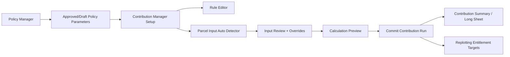
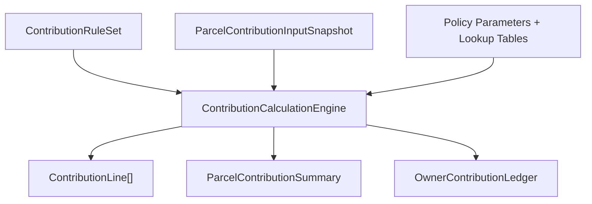

# Contribution Manager UI, UX, and Implementation Guide

## Purpose

The Contribution Manager is a separate form family for preparing and running land contribution calculations. It should not replace the Policy Manager. The Policy Manager stores official contribution and return policy clauses, parameters, and lookup tables. The Contribution Manager uses an approved or draft policy as a calculation source, then lets the project team configure how contribution headings are applied for the current project calculation run.

Reference mockups:

- `artifacts/contribution-manager-setup-concept.png`
- `artifacts/contribution-rule-editor-concept.png`
- `artifacts/parcel-input-auto-detector-concept.png`
- `artifacts/contribution-calculation-preview-audit-concept.png`

---

## Source Documents Reviewed

The guide is based on:

- `C:\Users\CYBORG\Downloads\RePlot-Policy-Parameters-Reference.docx`
- `C:\Users\CYBORG\Downloads\Baireni-LandPooling-Contribution-and-Return-Policy.docx`
- `LandRe-Adjustment Tool/Documentation Guides/CONTRIBUTION_RETURN_POLICY_MANAGER_IMPLEMENTATION_GUIDE.md`
- existing contribution entities:
  - `ContributionCategory`
  - `ParcelContribution`
  - `ParcelContributionSummary`

The source policy defines:

- always-on contribution rates
- road-contribution formula
- conditional additional rates
- corner-plot lookup table
- return constraints
- per-parcel input variables
- computed contribution outputs
- replotting and owner-ledger variables

---

## Simple Contribution Terms

Use these simple terms in the UI.

### General Contribution

General contributions apply to every parcel unless explicitly disabled.

Examples from the Baireni policy:

| Heading | Default |
|---|---:|
| Open Area | 5.04% |
| Infrastructure | 4.79% |
| Road Corner / Junction | 1.00% |
| Road Share | computed from road width formula |

The fixed common total from the first three rates is `10.83%`.

### Conditional Contribution

Conditional contributions apply only when parcel inputs meet a condition.

Examples:

| Heading | Condition | Default |
|---|---|---:|
| Open Space Adjoining | parcel adjoins open space within 8 m frontage | 3.00% |
| Open Space Across Road | parcel lies directly across road from open space | 2.00% |
| Central Depression | parcel falls in central depression/dhaap | 8.00% |
| Steep Slope | slope is above 30 degrees | 12.00% |
| Corner Plot | parcel has two-frontage corner | table lookup, 4.00% to 9.00% |

### Return Rules

Return rules are not contribution headings. They are constraints used later during replotting and ledger review.

Examples:

- minimum plot area `79.5 sqm`
- preferred minimum plot area `130 sqm`
- minimum frontage `6 m`
- parcel depth `13 m` to `20 m`
- block depth `26 m` to `40 m`
- road-side setback `1 m`
- window/door-side setback `1 m`
- consolidation max area `200 sqm`
- joint return threshold `150 sqm`
- project land rate per sqm

---

## Required Forms

The workflow should use four forms.

### 1. Contribution Manager Setup

Suggested form name:

```csharp
frmContributionManagerSetup
```

Purpose:

- select a contribution policy
- define contribution headings
- separate general and conditional contribution headings
- choose the value source for every heading
- validate the rule setup before input detection and calculation

Image:

- `artifacts/contribution-manager-setup-concept.png`

### 2. Contribution Rule Editor

Suggested form name:

```csharp
frmContributionRuleEditor
```

Purpose:

- add or edit one contribution heading
- choose whether it is general or conditional
- select policy parameter, manual override, or computed method
- define required inputs
- define missing-input behavior
- test the rule on an example parcel

Image:

- `artifacts/contribution-rule-editor-concept.png`

### 3. Parcel Input Auto Detector

Suggested form name:

```csharp
frmParcelContributionInputDetector
```

Purpose:

- automatically derive parcel inputs required for contribution calculation
- use topology from original parcels, road centerlines, blocks, open spaces, buildings, slope zones, and manual flags
- show detected values, missing values, warnings, and manual overrides
- save an auditable parcel input snapshot

Image:

- `artifacts/parcel-input-auto-detector-concept.png`

### 4. Contribution Calculation Preview and Audit

Suggested form name:

```csharp
frmContributionCalculationPreview
```

Purpose:

- run a preview calculation
- show parcel-by-parcel contribution lines
- show general, road, conditional, and total contribution rates
- show contribution area and entitlement area
- show owner ledger roll-up
- commit calculation with audit stamp when ready

Image:

- `artifacts/contribution-calculation-preview-audit-concept.png`

---

## Workflow Overview



Recommended menu entry:

```text
Contribution > Contribution Manager...
```

Sub-entries:

- Contribution Setup...
- Detect Parcel Inputs...
- Calculation Preview...
- Contribution Runs...

---

## Contribution Manager Setup

### Top Toolbar

Recommended commands:

- New
- Open Policy
- Save
- Save As
- Import Policy
- Export Policy
- Validate
- Calculate Preview
- Apply
- Reset
- Help

### Left Panel

Use a tree or checklist:

```text
Contribution Categories
  General Contributions
    Open Area
    Infrastructure
    Road Corner
    Road Share (Formula)
  Conditional Contributions
    Open Space Adjoining
    Open Space Across Road
    Central Depression
    Steep Slope
    Corner Plot
    Branch Road Special Case
    Collective Road Agreement
```

Keep branch-road and collective-road rules visible, but treat them as special logic/manual flags rather than simple additive headings unless the policy explicitly defines a rate.

### Main Grid

Use a `DataGridView`.

Recommended columns:

- Order
- Contribution Heading
- Type
- Policy Parameter
- Policy Value
- Manual Override
- Use Override
- Computed Method
- Applies To
- Required Inputs
- Enabled
- Notes

### Value Source Rules

Every contribution heading has one source mode.

#### Policy Parameter

The rule uses the value stored in the selected policy.

Example:

```text
Open Area = openAreaRate = 5.04%
```

#### Manual Override

The form copies the policy value into an editable field.

The UI must show:

- original policy value
- override value
- unit
- override reason
- user/date

The original policy value must be retained for audit.

#### Computed Method

The value is computed using a registered calculation method.

Examples:

- `RoadContributionStandard`
- `CornerTableLookup`
- `OpenSpaceRelationRate`
- `SlopeThresholdRate`
- `CentralDepressionFlagRate`

The computed method declares required inputs. The form should show whether those inputs are available.

---

## Contribution Rule Editor

Use this form when the user clicks `Add...` or `Edit...` in the setup form.

### Rule Identity

Fields:

- Heading Name
- Simple Name
- Contribution Type
  - General Contribution
  - Conditional Contribution
- Category
- Enabled
- Display Order
- Description

### Value Source

Radio buttons:

- Use Policy Parameter
- Manual Override
- Computed Method

Policy mode:

- policy parameter combo box
- policy value display
- unit display

Manual override mode:

- editable override value
- original policy value display
- unit
- required override reason

Computed method mode:

- method selector
- method configuration button
- formula description

### Condition / Required Inputs

Use a `DataGridView`.

Columns:

- Required
- Input Field
- Source
- Rule
- Missing Action

Examples:

| Input Field | Source | Rule |
|---|---|---|
| `isCorner` | Topology | equals true |
| `openSpaceRelation` | Topology | adjoining/across road |
| `slopeDegrees` | DEM / manual | greater than 30 |
| `inCentralDepression` | Topology / manual | equals true |
| `proposedRoadWidthM` | Road design | greater than 0 |
| `existingRoadWidthM` | Existing road/survey | greater than or equal 0 |
| `blockDepthM` | Block geometry | greater than 0 |
| `frontageM` | Geometry | greater than 0 |

Missing actions:

- Error
- Warning
- Skip Rule
- Use Default
- Require Manual Input

---

## Parcel Input Auto Detector

This form should run before calculation. It translates spatial data into calculation-ready parcel inputs.

### Data Sources

Inputs can come from:

- original parcel geometry
- original parcel/owner records
- road centerlines
- proposed road widths
- existing road/survey width data
- block polygons
- open-space polygons
- building inventory
- slope zone layer or DEM
- manual flags

### Derived Inputs

Required per-parcel input fields:

| Field | Source |
|---|---|
| `parcelId` / `kittaNo` | record / geometry link |
| `ownerIds` | owner records |
| `originalAreaSqM` | record or geometry |
| `frontageM` | geometry |
| `existingRoadWidthM` | existing road data or manual |
| `proposedRoadWidthM` | road centerline/design |
| `blockDepthM` | block geometry |
| `isCorner` | topology |
| `cornerMainRoadM` | topology + road widths |
| `cornerBranchRoadM` | topology + road widths |
| `frontageCount` | topology |
| `openSpaceRelation` | topology |
| `inCentralDepression` | zone/manual |
| `slopeDegrees` | DEM/slope layer/manual |
| `touchesExistingRoad` | topology |
| `branchRoadMajorityRequested` | manual flag |
| `hasCollectiveRoadAgreement` | manual flag |
| `hasHouse` | building inventory/manual |

### Topology Detection Rules

#### Road frontage

1. Intersect parcel boundary with road influence lines or road buffers.
2. Find the road edge/frontage segment.
3. Store frontage length.
4. Store road identity and proposed road width.

#### Existing road width

Use the most reliable source available:

1. assigned existing road width from road definition
2. survey map attribute
3. manual input
4. default only if the policy allows it

#### Block depth

Use the selected block geometry and road-facing edge. Store the block depth used by the road contribution formula.

#### Corner parcel

A parcel is corner-related when:

- it touches two valid road frontages, or
- it is at a road junction and has corner access, or
- policy-specific corner geometry rules mark it as corner.

Store main and branch road widths for corner table lookup.

#### Open-space relation

Classify as:

- None
- Adjoining
- Across Road

Adjoining means within the policy frontage band, such as `8 m`.

#### Slope/depression

Use slope zones, DEM, or manual flags. Because this can be uncertain, show warnings and let the user review.

### Output

The detector should save an input snapshot. The calculation engine should read the snapshot, not live geometry, so the calculation is reproducible.

---

## Calculation Preview and Audit

This form should show exactly what the engine will commit.

### Preview Grid

Recommended columns:

- Parcel
- Block
- Owner
- Original Area
- General Rate
- Road Rate
- Conditional Rate
- Total Rate
- Contribution Area
- Entitlement Area
- Status

### Selected Parcel Breakdown

For the selected parcel, show line items:

- contribution heading
- rate
- area
- source
- input values used
- applied/not applied

Example:

| Heading | Rate | Source |
|---|---:|---|
| Open Area | 5.04% | Policy |
| Infrastructure | 4.79% | Policy |
| Road Corner | 1.00% | Policy |
| Road Share | computed | `RoadContributionStandard` |
| Open Space Adjoining | 3.00% | Policy |
| Corner Plot | table lookup | `CornerTableLookup` |

### Commit Rules

The calculation cannot be committed when:

- policy is missing
- enabled contribution heading has no value source
- required parcel input has unresolved error
- a computed method has missing required inputs
- duplicate contribution heading keys exist
- calculation preview has errors

Commit stores:

- policy id/version/status
- contribution rule set version
- input snapshot id
- formula set id
- per-parcel line items
- per-parcel summary
- owner ledger roll-up
- timestamp and user

---

## Calculation Engine Model

The engine should not query geometry directly. It should receive:

1. configured contribution rules
2. parcel input snapshot rows
3. policy parameter values
4. lookup tables

Recommended flow:



### Core formula

For each parcel:

```text
totalContributionRate = sum(applied contribution line rates)
contributionAreaSqM = originalAreaSqM * totalContributionRate
entitlementAreaSqM = originalAreaSqM - contributionAreaSqM
```

Road contribution may be signed.

From the reference document:

```text
Road share = ((W - E) / 2) / ((D / 2) + ((W - E) / 2))
```

Where:

- `W` = proposed road width
- `E` = existing road width
- `D` = block depth

A negative road share means the owner regains land.

---

## Recommended Data Model

The current `ContributionCategory` is a useful start but should evolve into a versioned calculation profile.

### ContributionRuleSet

```csharp
public sealed class ContributionRuleSet
{
    public int Id { get; set; }
    public int PolicySetId { get; set; }
    public string Name { get; set; } = string.Empty;
    public string Status { get; set; } = "Draft";
    public int VersionNo { get; set; }
    public DateTime CreatedAtUtc { get; set; }
    public DateTime? ApprovedAtUtc { get; set; }
}
```

### ContributionRule

```csharp
public sealed class ContributionRule
{
    public int Id { get; set; }
    public int RuleSetId { get; set; }
    public string HeadingKey { get; set; } = string.Empty;
    public string HeadingName { get; set; } = string.Empty;
    public string ContributionType { get; set; } = "General"; // General, Conditional
    public string ValueSource { get; set; } = "Policy"; // Policy, ManualOverride, Computed
    public string? PolicyParameterKey { get; set; }
    public double? PolicyValue { get; set; }
    public double? OverrideValue { get; set; }
    public string Unit { get; set; } = "%";
    public string? ComputedMethodKey { get; set; }
    public bool IsEnabled { get; set; } = true;
    public int DisplayOrder { get; set; }
}
```

### ContributionRuleRequiredInput

```csharp
public sealed class ContributionRuleRequiredInput
{
    public int Id { get; set; }
    public int RuleId { get; set; }
    public string InputKey { get; set; } = string.Empty;
    public bool IsRequired { get; set; }
    public string MissingAction { get; set; } = "Error";
}
```

### ParcelContributionInputSnapshot

```csharp
public sealed class ParcelContributionInputSnapshot
{
    public long Id { get; set; }
    public int RuleSetId { get; set; }
    public DateTime CreatedAtUtc { get; set; }
    public string DetectionMode { get; set; } = "Topology";
    public string SourceSummaryJson { get; set; } = "{}";
}
```

### ParcelContributionInputRow

```csharp
public sealed class ParcelContributionInputRow
{
    public long Id { get; set; }
    public long SnapshotId { get; set; }
    public int BaselineParcelId { get; set; }
    public double OriginalAreaSqM { get; set; }
    public double? FrontageM { get; set; }
    public double? ExistingRoadWidthM { get; set; }
    public double? ProposedRoadWidthM { get; set; }
    public double? BlockDepthM { get; set; }
    public bool IsCorner { get; set; }
    public double? CornerMainRoadM { get; set; }
    public double? CornerBranchRoadM { get; set; }
    public string OpenSpaceRelation { get; set; } = "None";
    public bool InCentralDepression { get; set; }
    public double? SlopeDegrees { get; set; }
    public bool HasHouse { get; set; }
    public string ReviewStatus { get; set; } = "Ready";
}
```

### ContributionCalculationRun

```csharp
public sealed class ContributionCalculationRun
{
    public long Id { get; set; }
    public int RuleSetId { get; set; }
    public long InputSnapshotId { get; set; }
    public string Status { get; set; } = "Preview"; // Preview, Committed, Superseded
    public DateTime CreatedAtUtc { get; set; }
    public DateTime? CommittedAtUtc { get; set; }
    public string PolicyVersion { get; set; } = string.Empty;
    public string FormulaSet { get; set; } = string.Empty;
}
```

### ContributionCalculationLine

```csharp
public sealed class ContributionCalculationLine
{
    public long Id { get; set; }
    public long RunId { get; set; }
    public int BaselineParcelId { get; set; }
    public string HeadingKey { get; set; } = string.Empty;
    public string HeadingName { get; set; } = string.Empty;
    public bool Applied { get; set; }
    public double Rate { get; set; }
    public double ContributionAreaSqM { get; set; }
    public string Source { get; set; } = string.Empty;
    public string InputsJson { get; set; } = "{}";
}
```

---

## Recommended Services

```csharp
public interface IContributionRuleSetService
{
    Task<ContributionRuleSetDto> CreateFromPolicyAsync(int policySetId, CancellationToken ct = default);
    Task SaveDraftAsync(ContributionRuleSetDto ruleSet, CancellationToken ct = default);
    Task<ContributionSetupValidationResult> ValidateAsync(int ruleSetId, CancellationToken ct = default);
}

public interface IParcelContributionInputDetectionService
{
    Task<ParcelInputDetectionPreview> DetectAsync(ParcelInputDetectionRequest request, CancellationToken ct = default);
    Task<long> SaveSnapshotAsync(ParcelInputDetectionPreview preview, CancellationToken ct = default);
}

public interface IContributionCalculationEngine
{
    ContributionCalculationPreview Calculate(
        ContributionRuleSetDto ruleSet,
        IReadOnlyList<ParcelContributionInputDto> parcelInputs,
        PolicyParameterBag policyParameters,
        PolicyLookupTableBag lookupTables);
}

public interface IContributionCalculationRunService
{
    Task<ContributionCalculationPreview> RunPreviewAsync(int ruleSetId, long inputSnapshotId, CancellationToken ct = default);
    Task<long> CommitAsync(long previewRunId, CancellationToken ct = default);
}
```

---

## Implementation Phases

### Phase 1: UI Shells

- Create the four forms with placeholder data.
- Apply `RecordFormTheme`.
- Add menu entries under `Contribution`.
- Wire navigation between forms.

### Phase 2: Policy Integration

- Read policy sets, parameters, and lookup tables from the Policy Manager tables.
- Create rule sets from a selected policy.
- Support policy/manual/computed source modes.
- Preserve policy value when manual override is enabled.

### Phase 3: Rule Validation

- Validate heading keys.
- Validate duplicate headings.
- Validate missing parameter links.
- Validate manual override ranges.
- Validate computed method required inputs.

### Phase 4: Parcel Input Detection

- Build topology detector services.
- Detect frontage, road widths, corner status, open-space relation, block depth, slope/depression, and building flags.
- Store reviewed input snapshots.

### Phase 5: Calculation Preview

- Implement the calculation engine.
- Produce line items and summaries.
- Show parcel preview and selected parcel breakdown.
- Show owner ledger roll-up.

### Phase 6: Commit and Replot Integration

- Commit calculation run.
- Mark previous committed run as superseded when needed.
- Feed entitlement area into the replotting workspace.
- Use entitlement vs allocated area in the owner allocation panels.

---

## Acceptance Checklist

- [ ] User can add general contribution headings.
- [ ] User can add conditional contribution headings.
- [ ] Each heading can use policy value, manual override, or computed method.
- [ ] Manual override starts with the policy value and remains editable.
- [ ] Rule editor lists required inputs and missing-input actions.
- [ ] Policy selection reads available Policy Manager policies.
- [ ] Parcel input detector derives topology inputs before calculation.
- [ ] User can review and override detected inputs.
- [ ] Calculation preview shows parcel line items and total entitlement.
- [ ] Calculation commit stores policy version, rule set, input snapshot, and audit trail.
- [ ] Replotting workspace can read entitlement values from the committed calculation run.

---

## Image Generation Prompts Used

### Contribution Manager Setup

```text
A high fidelity screenshot mockup of a classic Windows Forms desktop application named RePlot. Window title: Contribution Manager Setup. Light gray WinForms theme, Segoe UI, menu bar, toolstrip, left checklist panel, central DataGridView for contribution ratios, right property editor, bottom validation grid, status strip. The central grid has rows Open Area 5.04 percent, Infrastructure 4.79 percent, Road Corner 1.00 percent, Road Share Formula. It supports Policy value, Manual override value, and Computed method. Professional GIS planning software style, compact practical controls, readable text, no web design, no dark mode.
```

### Contribution Rule Editor

```text
A high fidelity screenshot mockup of a classic Windows Forms desktop application named RePlot. Window title: Contribution Rule Editor. Light gray WinForms theme, Segoe UI, compact professional controls, not web, not dark mode.
This modal form lets the user add or edit one contribution heading for either General Contribution or Conditional Contribution.
Layout: left side contains rule identity fields: Heading Name, Simple Name, Contribution Type dropdown with General Contribution and Conditional Contribution, Category dropdown, Enabled checkbox, Display Order numeric, Description multiline box.
Middle section titled Value Source with radio buttons: Use Policy Parameter, Manual Override, Computed Method. Policy mode shows combo box policy parameter such as openSpaceAdjoiningRate 3.00 percent. Manual override retains the policy value in an editable numeric input with unit percent or sqm. Computed Method shows method combo RoadContributionStandard, CornerTableLookup, OpenSpaceRelation, SlopeThreshold, CentralDepressionFlag.
Right side titled Condition / Required Inputs. A DataGridView lists input fields: isCorner, openSpaceRelation, slopeDegrees, inCentralDepression, proposedRoadWidthM, existingRoadWidthM, blockDepthM, frontageM. Columns: Required, Input Field, Source, Rule, Missing Action. Include simple labels: Applies when parcel adjoins open space; Applies when slope above 30 degrees; Applies to all parcels.
Bottom panel titled Preview on Example Parcel with small grid: Original Area 250.00 sqm, Applied Rate 3.00%, Contribution Area 7.50 sqm, Entitlement 242.50 sqm. Buttons: Save Rule, Save and Add Another, Test Rule, Cancel. Make it practical, readable, and implementable in WinForms.
```

### Parcel Input Auto Detector

```text
High fidelity screenshot mockup of classic Windows Forms desktop app RePlot. Window title: Parcel Input Auto Detector. Light gray WinForms theme, Segoe UI, compact engineering GIS software.
Purpose: automatically derive parcel inputs needed before contribution calculation using topology from original parcels, road centerlines, blocks, open spaces, buildings, slope zones.
Layout: top toolstrip with Select Block, Select Policy, Run Detection, Accept Inputs, Export Review. Left panel: Detection Sources checklist with Original Parcels, Road Centerlines, Blocks, Open Spaces, Existing Buildings, Slope Zones, Manual Flags. Center: split view with map preview on top showing parcels, roads, block boundary, open space relation, corner parcels highlighted, frontage markers. Center bottom: DataGridView rows for parcels C-205, C-206, C-207 with columns Parcel, Owner, Area sqm, Frontage m, Existing Road Width, Proposed Road Width, Block Depth, Corner, Open Space Relation, Slope deg, House, Status. Right panel: Selected Parcel Inputs with editable overrides and source badges Geometry, Policy, Manual. Bottom panel: warnings grid with Missing existing road width, Slope needs review, Corner road width matched. Buttons Review Missing, Apply Manual Override, Re-run Selected. Status strip: Detection complete 428 parcels, 21 warnings. Practical readable WinForms UI, no web style, no dark mode.
```

### Contribution Calculation Preview and Audit

```text
High fidelity screenshot mockup of classic Windows Forms desktop app RePlot. Window title: Contribution Calculation Preview and Audit. Light gray WinForms theme, Segoe UI, compact professional municipal land readjustment software.
Purpose: review policy, configured contribution rules, detected parcel inputs, and calculation results before committing contribution calculation.
Layout: top toolbar with Policy selector Baireni Land Pooling Policy 2081, Scenario Base Calculation, buttons Validate Setup, Run Preview, Commit Calculation, Export Long Sheet. Left panel: Calculation Steps checklist with Policy selected, Contribution ratios configured, Parcel inputs detected, Missing inputs resolved, Preview calculated, Ready to commit. Center top: summary cards in classic group boxes, not web cards: Parcels 428, Ready 407, Warnings 21, Errors 0, Total original area, Total contribution area, Total entitlement area.
Center main: DataGridView titled Parcel Contribution Preview. Rows C-205, C-206, C-211 selected. Columns Parcel, Owner, Original Area, General Rate, Road Rate, Conditional Rate, Total Rate, Contribution Area, Entitlement Area, Status. Selected row C-211.
Right panel: Selected Parcel Breakdown with line items table: Open Area 5.04%, Infrastructure 4.79%, Road Corner 1.00%, Road Share 12.40%, Open Space Adjoining 3.00%, Corner Plot 6.68%. Each line has Source Policy, Manual, Computed. Show formula note Road contribution uses W, E, D. Bottom right: Audit stamp Policy Version Draft v1, Formula Set RoadContributionStandard, Input Snapshot, Save Audit Trail.
Bottom panel tabs: Issues, Calculation Log, Owner Ledger, Export Preview. Active Owner Ledger with grid Owner, Total Original Area, Entitlement, Allocated Later, Balance, Purchase/Refund. Status strip: Preview only, not committed. Practical readable WinForms UI, no web style, no dark mode, no decorative graphics.
```
