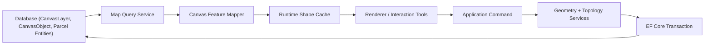

# Map Canvas and Land Readjustment Implementation Guide

## Related

- See `MAP_CANVAS_FINAL_ARCHITECTURE_VERIFICATION.md` for the verified, entity-aligned final canvas implementation baseline used for current development.

## Purpose

This document is a practical implementation guide for evolving the current application into a professional land readjustment desktop system with:

- a robust map canvas
- proper layer management
- strong connection between database entities and map geometry
- parcel creation and parcel splitting workflows
- backend-first land readjustment logic
- entity models that can support real project execution, not just drawing

This guide is based on:

- the current codebase
- the current EF Core entity models
- the current WinForms drawing canvas implementation
- the existing documentation in `Documentation/`
- the attached architecture, NTS, undo/redo, and project-structure reference documents

It is intentionally more detailed on backend design than UI design.

---

## 1. Product Understanding

The application you are building is not just a drawing tool and not just a records manager. It is a land readjustment workbench.

At a professional level, the application should support the full chain below:

1. Create or open a land pooling project.
2. Store project metadata, settings, coordinate system, and workspace folders.
3. Import raw parcel and owner records from Excel and legacy sources.
4. Normalize, validate, deduplicate, and preserve auditability of imported records.
5. Maintain original parcel, owner, frontage, and contribution data in a structured database.
6. Connect those records to map geometry on the canvas.
7. Draw, edit, validate, split, merge, and classify parcels spatially.
8. Design roads, blocks, deductions, and replotted parcel layouts.
9. Calculate contribution, net returnable area, allocation, and compensation.
10. Track original-to-replotted mapping and ownership allocation.
11. Produce reports, maps, logs, and evidence for project execution.

The map canvas is therefore not a visual extra. It is one of the main execution surfaces of the application.

---

## 2. Current State Assessment

## What is already good

The current codebase already has several strong foundations:

- `AppDbContext` already uses EF Core with NetTopologySuite.
- The database model already separates project, import, land data, canvas, layout, contribution, and replotting entities.
- The import model already preserves raw records, validation errors, and citizenship conflicts.
- The drawing canvas is already decomposed into useful pieces:
  - `DrawingEngine`
  - `ShapeManager`
  - `CanvasRenderer`
  - `UndoRedoManager`
- The canvas already supports snapping, DXF import, zoom/pan, and command-based undo/redo.
- Layer metadata already exists through `CanvasLayer`.

## Current architectural gaps

The biggest gaps are not in the amount of code. They are in the connection between parts.

### 2.1 Canvas runtime and database are still separate systems

Today the runtime canvas works mainly on `IShape` objects, while persistence is designed around `CanvasObject` with NTS `Geometry`.

That means:

- drawing is not yet driven by persisted spatial entities
- layer metadata is not the actual live style source for rendering
- shape edits are not first-class domain operations
- the canvas cannot yet be trusted as the system of record

### 2.2 DXF import currently loses important meaning

The current DXF import in `DrawingCanvasControl` converts many entities directly into simple line or text shapes. That is useful for visualization, but not sufficient for cadastral editing because:

- closed parcel boundaries are not promoted into real polygon features
- imported layer/source identity is not persisted as authoritative geometry metadata
- parcel semantics are lost during import

### 2.3 Parcel topology is not yet a first-class backend concern

The current drawing system is geometry-capable, but land readjustment requires topology-aware operations:

- polygon closure validation
- overlap detection
- sliver detection
- gap detection
- shared-edge consistency
- split and merge correctness
- road frontage and adjacency analysis

These should be backend services, not ad hoc UI logic.

### 2.4 Current entity linking is workable but still thin

The current `CanvasObject` model can link to `BaselineParcel`, `ReplottedParcel`, `Road`, and `Block`, which is a good start. But it still needs stronger semantics around:

- geometry source
- revision history
- derived measurements
- editing status
- topology validation state
- domain link type

### 2.5 Some current implementation details should be tightened

- `ShapeRepository` is still a placeholder.
- `frmLayerManager` says deleted-layer shapes move to the default layer, but the current form only removes the layer from the working list.
- `PolylineShape` behavior is still line-centric; a parcel polygon needs polygon semantics.
- `AppDbContext.SaveChanges` stamps dates with `DateTime.Now`; for long-lived project history, UTC should be preferred internally.
- Several models use string fields for type/state values that should become enums or controlled code tables.

---

## 3. Target Architecture

The best next architecture is not a rewrite. It is a layered bridge from the current code to a backend-first spatial system.

## 3.1 Recommended layers

### Presentation layer

Responsibilities:

- WinForms screens
- canvas interaction
- layer tree, property grid, dialogs
- tool state, cursor state, temporary preview graphics

Should not contain:

- topology calculations
- split algorithms
- contribution formulas
- persistence rules

### Application layer

Responsibilities:

- use cases and commands
- transaction boundaries
- orchestration between repository and domain services
- undoable document-changing operations

Examples:

- import parcel geometry
- assign parcel feature to baseline parcel
- split parcel by line
- create block from polygon
- generate candidate replots
- finalize contribution calculation

### Domain layer

Responsibilities:

- business rules
- spatial rules
- land readjustment algorithms
- validation and invariants

Examples:

- parcel must be closed and valid
- effective area cannot exceed original area without explicit override
- a replotted parcel must belong to exactly one block
- split operation must preserve total area within tolerance
- ownership allocation must total 100%

### Infrastructure layer

Responsibilities:

- EF Core
- SQLite persistence
- NTS geometry conversion and operations
- file/document storage
- import/export
- logging

## 3.2 Recommended DI structure for WinForms

The attached architecture references are directionally correct: this project should move toward real dependency injection rather than a service locator pattern.

Recommended registration shape:

```csharp
services.AddDbContext<AppDbContext>(options =>
    options.UseSqlite(connectionString, x => x.UseNetTopologySuite()));

services.AddScoped<IMapFeatureRepository, MapFeatureRepository>();
services.AddScoped<ILayerRepository, LayerRepository>();
services.AddScoped<IParcelRepository, ParcelRepository>();
services.AddScoped<ITopologyIssueRepository, TopologyIssueRepository>();

services.AddScoped<IGeometryShapeMapper, GeometryShapeMapper>();
services.AddScoped<ITopologyValidationService, TopologyValidationService>();
services.AddScoped<IParcelSplitService, ParcelSplitService>();
services.AddScoped<IMapFeatureService, MapFeatureService>();
services.AddScoped<ILayerService, LayerService>();
services.AddScoped<ILandReadjustmentService, LandReadjustmentService>();

services.AddTransient<frmMain>();
services.AddTransient<frmLayerManager>();
services.AddTransient<DrawingCanvasControl>();
```

Recommended pattern:

- repositories: scoped
- application services: scoped
- forms: transient
- pure stateless geometry helpers: singleton only if they have no mutable state

---

## 4. Recommended Canvas-Centric Backend Design

## 4.1 Core principle

The canvas should render projection models, but the authoritative spatial state should live in the database as geometry-backed domain-linked features.

In practice:

- `CanvasObject` should become the persisted map feature record
- the runtime `IShape` object should become a lightweight rendering/editing model
- conversion between them should be explicit and centralized

Recommended flow:

1. Load `CanvasObject` records and layer styles from database.
2. Convert them into runtime canvas shapes through a mapper.
3. Edit runtime shapes on the canvas.
4. Commit edits through application services.
5. Rebuild NTS geometry, validate, persist, and refresh cached render models.

Do not let the runtime shape list become the hidden source of truth.

## 4.2 Recommended runtime pipeline



## 4.3 Recommended backend services

These services are the missing backbone for the current map canvas.

```csharp
public interface IMapFeatureService
{
    Task<IReadOnlyList<MapFeatureDto>> GetFeaturesInViewportAsync(
        RectangleD worldViewport,
        CancellationToken cancellationToken = default);

    Task<MapFeatureDto?> GetFeatureAsync(Guid featureId, CancellationToken cancellationToken = default);

    Task<Guid> CreateFeatureAsync(CreateMapFeatureCommand command, CancellationToken cancellationToken = default);

    Task UpdateGeometryAsync(UpdateFeatureGeometryCommand command, CancellationToken cancellationToken = default);

    Task ReassignLayerAsync(Guid featureId, int targetLayerId, CancellationToken cancellationToken = default);

    Task DeleteFeatureAsync(Guid featureId, CancellationToken cancellationToken = default);
}

public interface ITopologyValidationService
{
    TopologyValidationResult ValidateFeature(Geometry geometry, FeatureValidationContext context);
    ProjectTopologyReport ValidateProject(IEnumerable<Geometry> parcelGeometries);
}

public interface IParcelSplitService
{
    ParcelSplitPreview PreviewSplit(ParcelSplitRequest request);
    ParcelSplitResult ExecuteSplit(ParcelSplitRequest request);
}

public interface ILandReadjustmentService
{
    Task<ContributionComputationResult> RecalculateContributionAsync(int projectId);
    Task<ReplotScenarioResult> GenerateScenarioAsync(ReplotScenarioRequest request);
    Task<AllocationResult> AllocateReplottedParcelsAsync(AllocationRequest request);
}

public interface ILayerService
{
    Task<IReadOnlyList<CanvasLayer>> GetLayersAsync(CancellationToken cancellationToken = default);
    Task<int> CreateLayerAsync(CreateLayerCommand command, CancellationToken cancellationToken = default);
    Task UpdateLayerAsync(UpdateLayerCommand command, CancellationToken cancellationToken = default);
    Task DeleteLayerAsync(DeleteLayerCommand command, CancellationToken cancellationToken = default);
}
```

## 4.4 Important implementation rule

Every operation that changes geometry should go through an application command, not directly from the control to the database.

Examples:

- `CreateParcelFromPolylineCommand`
- `SplitParcelByLineCommand`
- `MergeParcelsCommand`
- `AssignFeatureToBaselineParcelCommand`
- `CreateRoadCenterlineCommand`
- `CreateBlockFromBoundaryCommand`
- `FinalizeReplotScenarioCommand`

This is how you get:

- undo/redo
- validation
- audit trail
- consistent recalculation

## 4.5 Recommended transaction boundary

One geometry-changing operation should usually equal one database transaction.

Example:

`SplitParcelByLineCommand` should do all of this in one transaction:

1. load source parcel and source canvas feature
2. validate current state
3. compute split result geometries
4. create split operation record
5. create child parcel records or child geometry revisions
6. update feature links
7. create topology issue records if needed
8. save and commit

If any part fails, the whole operation should roll back.

---

## 5. Layer Management Design

## 5.1 What layer management should do

The layer system should control:

- visibility
- lock state
- selectability
- printability
- display order
- style defaults
- labeling rules
- source provenance

It should not contain business truth about parcels or owners by itself.

## 5.2 Recommended layer taxonomy

Use a clear fixed taxonomy for built-in layers and allow custom layers beside them.

### Base survey and reference layers

- Project boundary
- Survey control points
- Basemap reference
- Existing roads
- Existing buildings
- Natural features

### Original cadastral layers

- Original parcel boundaries
- Original parcel labels
- Original owner annotations
- Malpot/reference overlays

### Planning and design layers

- Proposed roads
- Road right-of-way
- Blocks
- Public use land
- Utilities / drainage / open space

### Replotting layers

- Candidate replotted parcels
- Approved replotted parcels
- Allocation labels
- Contribution heatmap overlay

### Editing support layers

- Construction lines
- Temporary split guides
- Snap references
- Review issues / topology errors

## 5.3 Layer deletion behavior

The correct backend behavior for deleting a layer should be explicit and transactional:

1. User chooses delete.
2. System asks whether features should:
   - move to default layer
   - move to another selected layer
   - be deleted with the layer
3. Application service performs the change.
4. Database and canvas refresh together.

Do not leave this as a UI-only convention.

## 5.4 Labeling behavior

Labels should be generated from domain-aware rules rather than raw string assignments where possible.

Examples:

- original parcel: `FullUniqueParcelCode`
- replotted parcel: `DerivedNumber`
- owner overlay: primary owner full name
- block: `BlockCode`
- road: `RoadCode` or width

Recommended label sources:

- entity field
- computed expression
- custom override

---

## 6. Connecting Data to the Map Canvas

This is the most important missing bridge in the current implementation.

## 6.1 Recommended rule

Every parcel, road, and block that is spatially editable should have one authoritative geometry feature in the canvas subsystem.

Recommended mapping:

- `BaselineParcel` <-> one polygon `CanvasObject`
- `ReplottedParcel` <-> one polygon `CanvasObject`
- `Road` <-> one line or polygon `CanvasObject`
- `Block` <-> one polygon `CanvasObject`

That existing one-to-one direction in `AppDbContext` is good and should be preserved.

## 6.2 Recommended synchronization model

### Database is authoritative

Persist:

- geometry
- layer assignment
- style override
- label override
- link to domain entity

### Runtime canvas is editable cache

Runtime shapes can keep:

- screen-friendly points
- selection state
- preview state
- transient handles
- rubber-band preview

### Domain data is joined at query time

For display and tools, fetch joined projection models such as:

```csharp
public sealed class MapFeatureDto
{
    public Guid Id { get; init; }
    public int LayerId { get; init; }
    public string LayerName { get; init; } = string.Empty;
    public string ObjectType { get; init; } = string.Empty;
    public Geometry Geometry { get; init; } = null!;
    public string? DisplayLabel { get; init; }
    public string? DomainEntityType { get; init; }
    public int? DomainEntityId { get; init; }
    public string? ParcelCode { get; init; }
    public string? OwnerName { get; init; }
    public double? AreaSqm { get; init; }
    public bool IsLocked { get; init; }
    public bool IsVisible { get; init; }
    public string? BorderColor { get; init; }
    public string? FillColor { get; init; }
}
```

## 6.3 Import-to-canvas flow

Recommended import workflow:

1. Import tabular records.
2. Import cadastral geometry from DXF/Shapefile/GeoJSON.
3. Match geometry to parcel records by parcel code, layer rule, text anchor, or manual review.
4. Persist matched geometry to `CanvasObject`.
5. Mark unmatched geometry as reference features, not parcel features.
6. Produce an issue list for:
   - unmatched parcel records
   - unmatched geometries
   - duplicate parcel codes
   - invalid polygons
   - topology issues

## 6.4 Two-way linking behavior

When a parcel record changes:

- labels and property panels update
- geometry does not automatically change unless geometry-dependent fields are recalculated

When parcel geometry changes:

- area should recalculate
- topology should validate
- frontage and adjacency may need recalculation
- contribution summaries may need invalidation
- replot allocation impacts may need warning flags

This invalidation pattern should be explicit in services.

## 6.5 Recommended mapper responsibilities

Create one mapper whose job is only conversion, not business logic.

```csharp
public interface IGeometryShapeMapper
{
    IShape ToRuntimeShape(CanvasObject source, CanvasLayer layer);
    Geometry ToGeometry(IShape shape);
    RuntimeShapeStyle ResolveStyle(CanvasObject source, CanvasLayer layer);
}
```

This mapper should handle:

- polygon, polyline, line, circle, point, and text conversion
- style resolution from layer defaults plus object overrides
- label text resolution
- geometry normalization before persistence

Do not spread this conversion across forms, renderers, and repositories.

---

## 7. How Land Readjustment Should Work on the Map Canvas

Land readjustment on the canvas should be a guided spatial workflow, not free drawing with manual bookkeeping.

## 7.1 Recommended major workflow

### Stage 1: Prepare original land base

- load original parcels
- clean topology
- verify ownership links
- confirm project boundary
- identify existing roads and deductions

### Stage 2: Define planning framework

- create or import proposed roads
- create blocks enclosed by the new road framework
- classify block land use and constraints
- compute usable replottable land

### Stage 3: Calculate contribution and net returnable area

- compute contribution categories
- store parcel contribution summaries
- show deficit/surplus by parcel
- color parcels by contribution class or unresolved issues

### Stage 4: Generate replotted parcel candidates

- define parcel types by block
- generate candidate plots using frontage/depth or template rules
- validate minimum area and access
- compare generated area against net returnable totals

### Stage 5: Allocate replotted parcels

- map original owners or ownership groups to replotted parcels
- store one-to-many or many-to-many allocation
- visualize allocation conflicts
- compare assigned area vs returnable area

### Stage 6: Review and finalize

- run topology validation
- run numbering validation
- run ownership share validation
- lock approved geometry
- issue reports and export layers

## 7.2 What the user should see on the canvas during land readjustment

The canvas should be able to visualize:

- original parcel boundary
- replotted parcel candidate
- contribution heatmap
- owner allocation status
- unresolved topology issues
- block envelopes
- road deduction zones
- frontage lines
- split preview lines
- difference area annotation

## 7.3 Backend rules needed for land readjustment

At minimum, backend services should support:

- topology validation for all parcel polygons
- area reconciliation after each edit
- adjacency graph generation
- frontage extraction to roads
- contribution recalculation invalidation
- scenario comparison
- finalization lock state

## 7.4 Suggested spatial analytics to support the workflow

These are high-value backend computations for land readjustment:

- parcel adjacency graph
- parcel-to-road accessibility check
- frontage length extraction
- block compactness / usability metrics
- area deficit and surplus summary by owner
- nearest candidate replotted parcel ranking
- corner plot detection
- irregular-shape warning detection

These do not all need to be built immediately, but the entity and service design should leave room for them.

---

## 8. Parcel Drawing and Parcel Creation Techniques

You asked specifically for different ways parcels can be drawn and created. In a professional system, parcel creation should support multiple methods because field data quality and working style vary.

## 8.1 Manual closed-polyline polygon

Use when:

- the operator is tracing a parcel boundary manually
- source image or reference layer exists

Flow:

1. User picks parcel layer.
2. User starts polygon mode.
3. Vertices snap to existing points, segments, or guides.
4. Polygon closes explicitly or by snap-to-start.
5. Backend validates:
   - closed ring
   - minimum 3 unique vertices
   - no self-intersection
   - valid polygon orientation and area
6. User is prompted to link to a parcel record or create a new one.

## 8.2 Rectangle by two points

Use when parcels are approximately orthogonal and drafting speed matters.

Backend should:

- generate polygon from drag box
- preserve area
- optionally constrain to orthogonal angle

## 8.3 Rectangle by frontage and depth

Very useful for replot generation.

Inputs:

- frontage start line or road edge
- frontage width
- plot depth
- side orientation

Backend should:

- build polygon from frontage baseline
- check road access
- validate against block envelope

## 8.4 Offset from existing edge

Use for road deductions, setbacks, and derived parcel boundaries.

Examples:

- create parcel line offset 3m from road edge
- create right-of-way buffer

Backend should use NTS buffering or offset-curve logic, then clip to the active block or parcel boundary.

## 8.5 Trace from imported linework

Use when DXF or survey linework exists but polygons are not directly available.

Backend steps:

1. collect selected lines
2. node them
3. polygonize them
4. show candidate polygons
5. let user confirm which polygon becomes parcel

## 8.6 Coordinate or bearing-distance entry

Use when legal survey data is available.

Inputs:

- easting/northing pairs
- bearing and distance sequences

This is important for professional cadastral workflows and should be supported even if not in the first release.

## 8.7 Template-based plot generation

Use for replotted parcels inside blocks.

Inputs:

- block polygon
- road-facing side
- target plot type
- minimum frontage
- preferred depth range
- target area range

Backend then generates candidate replots instead of forcing manual drawing one parcel at a time.

---

## 9. Parcel Splitting Techniques

Parcel splitting should be a full subsystem. It is one of the most important operational pieces for land readjustment.

## 9.1 General backend rule for every split

Every split operation should:

1. take one source parcel geometry
2. apply a split rule
3. generate candidate result polygons
4. validate topology
5. compare total source area to total result area within tolerance
6. persist a split operation record
7. create child parcel features or versions
8. update linkage and audit trail

## 9.2 Split by drawn line

User draws a split line across a polygon.

Best for:

- manual planning
- adjusting irregular parcels

Backend approach:

- extend or trim split line to polygon boundary if needed
- node line with polygon boundary
- polygonize resulting edges
- keep only polygons inside source parcel

## 9.3 Split by polyline corridor

Useful when road deduction or internal passage cuts through a parcel.

Backend:

- create buffered corridor polygon from drawn line
- subtract corridor from source parcel
- persist corridor as road/public-use feature if applicable

## 9.4 Split by target area

User asks for one part to have a target area, for example 120 sqm.

Best for:

- contribution deduction
- returnable area balancing

Backend logic:

- choose split direction or frontage base
- solve candidate cut position iteratively
- stop when area difference is within tolerance

This should be implemented as a proper geometry solver, not by repeated manual trial.

## 9.5 Split by frontage and depth

Classic replotted-parcel generation method.

Inputs:

- selected road edge
- frontage width
- depth

Backend:

- derive frontage segment
- construct perpendicular or design-angle depth lines
- clip to parcel/block envelope

## 9.6 Split into equal widths

Useful for row-style housing or repetitive block subdivision.

Inputs:

- frontage edge
- number of parcels or target frontage

Backend:

- divide base edge
- construct split lines normal to the edge or along block axis

## 9.7 Split into equal areas

Useful where width regularity is less important than area equality.

Backend:

- select split axis
- solve positions iteratively until each generated polygon area meets target

## 9.8 Split by percentage

Example:

- 30% deduction for road contribution
- 70% returnable area

This is a special case of target-area split, but it should exist as a direct tool because it matches business language.

## 9.9 Split by radial or centroid method

Useful for irregular corner plots, rotaries, or circular edges.

Backend:

- choose center point
- divide by angle or radial lines

## 9.10 Split by selected vertices

Advanced manual mode where the user chooses two existing vertices or snap points to define the split.

Useful for:

- parcel correction
- topology-safe drafting

## 9.11 Split by block template

Instead of splitting one parcel, the system subdivides an entire block using design rules.

This is the most powerful method for actual land readjustment.

Inputs:

- block polygon
- road-facing boundary
- plot type
- minimum frontage
- target area
- side lane rules
- corner plot rules

Outputs:

- many candidate replotted parcels at once

## 9.12 Split by legal road setback or buffer

Use when part of a parcel is taken by right-of-way, easement, utility line, or open-space rule.

Backend:

- create buffer polygon
- intersect or subtract from parcel
- classify result part by purpose

## 9.13 Recommended split service data contract

```csharp
public enum SplitMethodType
{
    LineCut = 1,
    CorridorCut = 2,
    TargetArea = 3,
    FrontageDepth = 4,
    EqualWidths = 5,
    EqualAreas = 6,
    Percentage = 7,
    Radial = 8,
    VertexToVertex = 9,
    BlockTemplate = 10,
    BufferDeduction = 11
}

public sealed class ParcelSplitRequest
{
    public int SourceParcelId { get; init; }
    public SplitMethodType Method { get; init; }
    public Geometry? SplitGeometry { get; init; }
    public int? ResultParcelCount { get; init; }
    public double? TargetAreaSqm { get; init; }
    public double? TargetPercentage { get; init; }
    public double? FrontageLength { get; init; }
    public double? PlotDepth { get; init; }
    public string? Notes { get; init; }
}
```

---

## 10. UI and UX Recommendations

The backend is the priority, but the canvas UX matters because complex operations can become confusing very quickly.

## 10.1 Recommended canvas workspace layout

- left: layer tree and project explorer
- center: map canvas
- right: properties, parcel info, split parameters, topology warnings
- bottom: validation log, command history, coordinates, scale

## 10.2 Recommended tool grouping

### Navigation

- pan
- zoom
- zoom window
- zoom extents
- previous/next view

### Selection

- select feature
- select by rectangle
- select by polygon
- select linked record

### Drawing

- line
- polygon
- rectangle
- frontage-depth parcel
- block template generator

### Editing

- move vertex
- add vertex
- delete vertex
- split parcel
- merge parcels
- reshape edge
- offset edge

### Validation

- validate selected feature
- validate visible extent
- validate project topology
- show overlap/gap issues

### Land readjustment

- create block
- create proposed road
- calculate contribution
- generate replots
- allocate owner
- compare scenarios

## 10.3 UX rules

- every destructive change needs preview before commit
- every split should show result area per child polygon before save
- validation warnings should highlight geometry on the canvas
- selected parcel panel should show owner, area, frontage, contribution, and linked replots
- locked and finalized features should be visibly different

---

## 11. Current Entity Model Review

This section reviews the current entity models and how they should evolve.

## 11.1 `ProjectInfo`

Good:

- captures project identity and administration data

Recommended additions:

- `ProjectCode`
- `ProjectStatus`
- `WorkspaceRootPath`
- `ActiveScenarioId`

## 11.2 `ProjectSettings`

Good:

- already stores CRS and important canvas settings

Recommended additions:

- `AreaToleranceSqm`
- `TopologyToleranceMeters`
- `DefaultParcelLayerId`
- `DefaultRoadLayerId`
- `DefaultBlockLayerId`
- `DefaultSnappingModes`
- `UseUtcTimestamps`

## 11.3 `LandOwner`

Good:

- already designed for deduplication-aware ownership

Recommended additions:

- `OwnerCode`
- `OwnerType` such as individual, joint, institution
- `IsActive`
- `PreferredDisplayName`
- `NormalizedFullName`
- `NormalizedFatherOrSpouseName`

## 11.4 `MalpotReference`

Good:

- represents official reference grouping well

Recommended additions:

- `ReferenceRemarks`
- `ReferenceSource`
- `ExternalReferenceId`

## 11.5 `BaselineParcel`

Good:

- already captures original/effective area and owner link

Recommended additions:

- `ParcelStatus`
- `GeometryStatus`
- `AreaSource`
- `CalculatedAreaSqm`
- `AreaDifferenceSqm`
- `HasTopologyIssue`
- `LastTopologyCheckDate`
- `ProjectId` if project scoping may become multi-project inside one database

Important note:

The current parcel entity is record-strong but geometry-light. For a spatially mature system, it should know whether its geometry is validated and whether stored area comes from record, geometry, or manual override.

## 11.6 `CanvasLayer`

Good:

- already strong enough for a first real implementation

Recommended additions:

- `LayerCode`
- `LayerGroup`
- `IsSystemLayer`
- `SelectionPriority`
- `MinVisibleScale`
- `MaxVisibleScale`
- `GeometryTypeConstraint`

## 11.7 `CanvasObject`

Good:

- this is the right place for authoritative geometry persistence

Recommended additions:

- `FeatureStatus`
- `DomainEntityType`
- `DomainEntityId`
- `GeometryRevisionNo`
- `CalculatedAreaSqm`
- `CalculatedPerimeterM`
- `CentroidX`
- `CentroidY`
- `SourceType`
- `SourceFilePath`
- `SourceFeatureKey`
- `IsTopologyValid`
- `LastTopologyValidationMessage`

Important note:

The current nullable foreign keys to parcel/road/block are workable, but a generic `DomainEntityType` plus `DomainEntityId` is often easier for generalized feature tooling. If you keep the existing explicit foreign keys, then add stronger validation rules and a check that only one domain link is populated.

## 11.8 `Road`

Good:

- good base attributes for width and road type

Recommended additions:

- `RoadAlignmentType`
- `RoadCenterlineFeatureId`
- `RoadPolygonFeatureId`
- `HierarchyOrder`
- `DesignSpeed`
- `IsExisting`
- `IsProposed`

## 11.9 `Block`

Good:

- already positioned as the replot container

Recommended additions:

- `BlockStatus`
- `DevelopableAreaSqm`
- `RoadFrontageLength`
- `PrimaryAccessRoadId`
- `TemplateType`

## 11.10 `ParcelFrontage`

Good:

- important entity for frontage-based planning

Recommended additions:

- `FrontageType`
- `IsPrimaryFrontage`
- `RoadEdgeFeatureId`

## 11.11 `ContributionCategory`, `ParcelContribution`, `ParcelContributionSummary`

Good:

- already very close to what is needed for contribution calculation

Recommended additions:

- formula version or rule version
- approval status
- calculated-by scenario
- invalidation flag
- recalculation reason

## 11.12 `ReplottedParcel`

Good:

- already supports numbering and plot type

Recommended additions:

- `ParcelStatus`
- `DesignAreaSqm`
- `CalculatedAreaSqm`
- `AllocationStatus`
- `ScenarioId`
- `HasRoadAccess`
- `HasTopologyIssue`

## 11.13 `OriginalToReplottedMap`

Good:

- right idea for core traceability

Recommended additions:

- `AllocationPercent`
- `AllocationAreaSqm`
- `AllocationType`
- `ScenarioId`
- `Notes`

This entity will become central once allocation becomes more than a simple mapping table.

## 11.14 `ReplottedParcelOwner`

Good:

- provides many-to-many ownership structure

Recommended additions:

- `OwnershipAreaSqm`
- `OwnershipBasis`
- `IsPrimaryOwner`

---

## 12. Recommended New Entities

The following additions will make the system far more implementable without overcomplicating the first release.

## 12.1 `CanvasObjectRevision`

Use for geometry history and undoable audit.

```csharp
public class CanvasObjectRevision
{
    public long Id { get; set; }
    public Guid CanvasObjectId { get; set; }
    public int RevisionNo { get; set; }
    public Geometry Shape { get; set; } = null!;
    public string ChangeType { get; set; } = string.Empty;
    public string? ChangedBy { get; set; }
    public DateTime ChangedAtUtc { get; set; }
    public string? Notes { get; set; }
}
```

## 12.2 `TopologyIssue`

Use to persist validation findings.

```csharp
public class TopologyIssue
{
    public long Id { get; set; }
    public Guid? CanvasObjectId { get; set; }
    public string IssueType { get; set; } = string.Empty;
    public string Severity { get; set; } = string.Empty;
    public string Message { get; set; } = string.Empty;
    public Geometry? IssueGeometry { get; set; }
    public bool IsResolved { get; set; }
    public DateTime CreatedAtUtc { get; set; }
    public DateTime? ResolvedAtUtc { get; set; }
}
```

## 12.3 `ParcelSplitOperation`

Use to persist split metadata and support audit/undo/reporting.

```csharp
public class ParcelSplitOperation
{
    public long Id { get; set; }
    public int SourceBaselineParcelId { get; set; }
    public string SplitMethod { get; set; } = string.Empty;
    public Geometry? SplitGeometry { get; set; }
    public double SourceAreaSqm { get; set; }
    public double ResultAreaSqm { get; set; }
    public double AreaDifferenceSqm { get; set; }
    public bool IsCommitted { get; set; }
    public DateTime CreatedAtUtc { get; set; }
    public string? Notes { get; set; }
}
```

## 12.4 `ParcelSplitResult`

Use to capture child outputs of a split.

```csharp
public class ParcelSplitResult
{
    public long Id { get; set; }
    public long ParcelSplitOperationId { get; set; }
    public int? ResultBaselineParcelId { get; set; }
    public Guid? ResultCanvasObjectId { get; set; }
    public int SequenceNo { get; set; }
    public double AreaSqm { get; set; }
    public string? ResultCode { get; set; }
}
```

## 12.5 `ReplotScenario`

Use to support multiple design alternatives.

```csharp
public class ReplotScenario
{
    public int Id { get; set; }
    public string ScenarioName { get; set; } = string.Empty;
    public bool IsActive { get; set; }
    public bool IsApproved { get; set; }
    public string? Description { get; set; }
    public DateTime CreatedAtUtc { get; set; }
    public DateTime LastModifiedAtUtc { get; set; }
}
```

## 12.6 `ScenarioMetric`

Use to compare design alternatives quickly.

```csharp
public class ScenarioMetric
{
    public long Id { get; set; }
    public int ScenarioId { get; set; }
    public string MetricCode { get; set; } = string.Empty;
    public double MetricValue { get; set; }
    public string? MetricText { get; set; }
}
```

---

## 13. Recommended Database and EF Core Rules

## 13.1 Add stronger constraints

Recommended constraints:

- unique layer name per project
- unique parcel code per project
- unique active replotted parcel number per scenario
- check that `CanvasObject` is linked to at most one of baseline parcel, replotted parcel, road, or block
- check that `ReplottedParcelOwner` share total equals 100% for each parcel before approval

## 13.2 Store geometry-derived fields

For parcel and feature records, store:

- calculated area
- perimeter
- centroid
- envelope

This is not duplication for duplication's sake. It improves:

- list/grid performance
- filtering
- reporting
- sanity checks

## 13.3 Use UTC internally

Use UTC for:

- revision history
- audit records
- import sessions
- topology validation
- operation logs

User-facing forms can still display local time.

## 13.4 Indexes worth adding

- `CanvasObject(CanvasLayerId, IsVisible)`
- spatial index support pattern for geometry lookups where provider allows
- `BaselineParcel(LandOwnerId)`
- `BaselineParcel(MalpotReferenceId)`
- `OriginalToReplottedMap(BaselineParcelId, ReplottedParcelId)`
- `ParcelFrontage(RoadId, BaselineParcelId, ReplottedParcelId)`
- `TopologyIssue(CanvasObjectId, IsResolved)`

## 13.5 Recommended enum strategy

A number of current string properties should eventually become:

- enums in C#
- controlled text in the database
- or code tables when user-extensible

High-priority examples:

- `CanvasObject.ObjectType`
- `CanvasLayer.LayerType`
- `ContributionCategory.ContributionType`
- `ContributionCategory.RateType`
- `ReplottedParcel.ActiveNumberType`
- parcel status and geometry status fields that you add next

This reduces typo-driven bugs and makes business logic safer.

---

## 14. Undo/Redo and Revision Strategy

The reference documentation is correct: document-changing commands and view-navigation history should be different systems.

## 14.1 Keep command undo/redo for document edits

Use for:

- create feature
- edit geometry
- split parcel
- merge parcels
- move feature to another layer
- renumber replotted parcel

## 14.2 Keep a separate view history

Use for:

- pan
- zoom
- zoom extents
- previous view
- next view

Do not mix these into the same undo stack as geometry edits.

## 14.3 Persist revisions for critical geometry changes

For professional work, memory-only undo is not enough. Important geometry changes should also create persisted revisions in `CanvasObjectRevision`.

---

## 15. Recommended Implementation Phases

This sequence is designed to build on the current code rather than replace it.

## Phase 1: Build the persistence bridge

Deliverables:

- implement `ShapeRepository` properly as a `CanvasObject` repository
- add `IShape <-> Geometry` mapper
- load canvas from database-backed features
- persist create/update/delete through services

Success condition:

The canvas displays and edits database-backed map features instead of only in-memory shapes.

Phase 1 status update (April 27, 2026):

- implemented `CanvasLayerRepository` for ordered/visible layer access
- implemented `CanvasObjectRepository` with GUID-key CRUD and viewport query
- added explicit tracked-entity detaching in update path to prevent duplicate-key EF tracking collisions
- added `GeometryShapeMapper` for `IShape <-> CanvasObject.Shape` conversion
- added `CanvasFeatureService` to orchestrate layer resolution + save/load mapping
- wired new repositories and service into `IProjectScopedFactory` and `ProjectScopedFactory`

## Phase 2: Make parcels topology-aware

Deliverables:

- polygon validation service
- overlap/gap detection
- parcel area recalculation
- project topology issue list

Success condition:

Parcel polygons become reliable inputs for land readjustment.

## Phase 3: Add parcel editing and split subsystem

Deliverables:

- polygon parcel tool
- reshape edge tool
- split by line
- split by target area
- split by frontage/depth
- revision tracking

Success condition:

Operators can create and modify parcels safely and repeatably.

## Phase 4: Add block and road design workflow

Deliverables:

- road creation tools
- block generation and validation
- frontage extraction
- developable area calculation

Success condition:

The planning framework for replotting exists spatially in the system.

## Phase 5: Add replot scenario engine

Deliverables:

- scenario entity
- candidate plot generator
- allocation mapping
- scenario comparison metrics

Success condition:

The map canvas becomes an actual land readjustment design environment.

## Phase 6: Approval, audit, and reporting

Deliverables:

- lock/finalize workflow
- revision browsing
- issue dashboard
- printable outputs and exports

Success condition:

The project can be reviewed, approved, and defended operationally.

---

## 16. Testing Strategy

This system will become difficult to trust unless the geometry and land readjustment logic are tested outside the UI.

## 16.1 Unit tests

Focus on:

- geometry conversion
- topology validation
- split algorithms
- area reconciliation
- contribution formulas
- scenario allocation logic

## 16.2 Integration tests

Focus on:

- EF Core persistence with SQLite
- geometry save/load round trips
- command transaction behavior
- linked parcel and feature updates

## 16.3 Canvas interaction tests

Even if full UI automation is limited, cover:

- create parcel command flow
- split preview to commit flow
- layer visibility and lock behavior
- undo/redo document changes

## 16.4 Golden-data project tests

Create one or two realistic sample project databases with:

- imported owners
- imported baseline parcels
- a few roads
- known topology issues
- expected split outcomes

These become your regression datasets for future refactoring.

---

## 17. Recommended Immediate Code Priorities

If implementation starts now, these are the highest-value tasks in order:

1. Replace the placeholder `ShapeRepository` with a real `CanvasObject` persistence service.
2. Introduce a centralized `GeometryShapeMapper` between NTS geometry and runtime `IShape`.
3. Create a polygon-focused parcel feature model instead of relying on generic polyline behavior.
4. Add topology validation and persisted issue tracking.
5. Add transaction-backed layer delete/reassign behavior.
6. Add parcel split service with preview and commit flow.
7. Add geometry revision history.
8. Add scenario-based replotting rather than directly overwriting final replotted parcels.

---

## 18. Final Recommendation

The current project is already much closer to a real professional land readjustment platform than a typical WinForms application, because the entity model and the canvas foundation are already present.

The next major leap is not "more forms" and not "more drawing tools." The next leap is to make geometry a first-class, validated, revisioned, domain-linked backend asset.

If you do that well, then:

- the layer manager becomes meaningful
- the map canvas becomes operational
- parcel editing becomes trustworthy
- land readjustment workflows become implementable
- reports and approvals become defensible

That is the point where the software starts behaving like real land planning software rather than a collection of independent modules.
